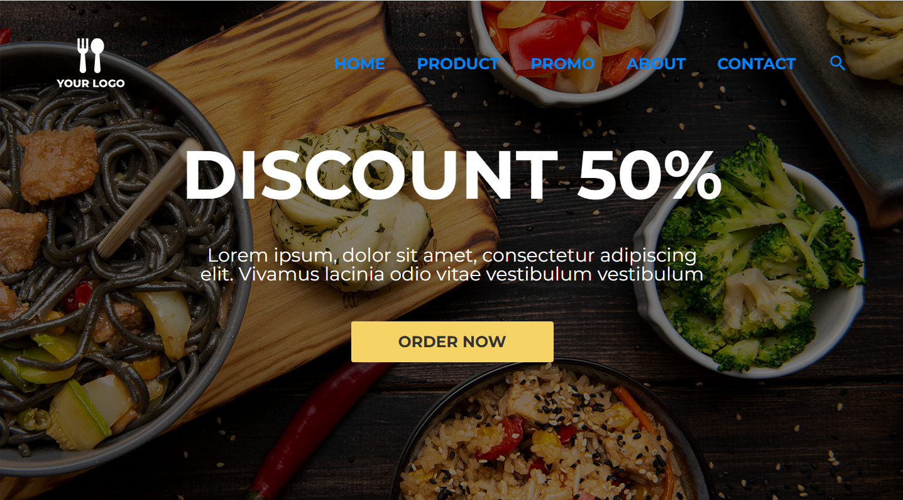

<h1 align="center">Ресторанный шаблонный сайт</h1>

  
  
  

В данном сайте используется: <strong>CSS</strong> <strong>SCSS</strong> <strong>Vite</strong> <strong>React</strong> <strong>Redux toolkit</strong> <strong>Typescript</strong>

***
Чтобы запустить проект нужно ввести 
git clone https://github.com/Yersult4an/responsiveRestaurantSite.git  
npm install  
npm run dev  